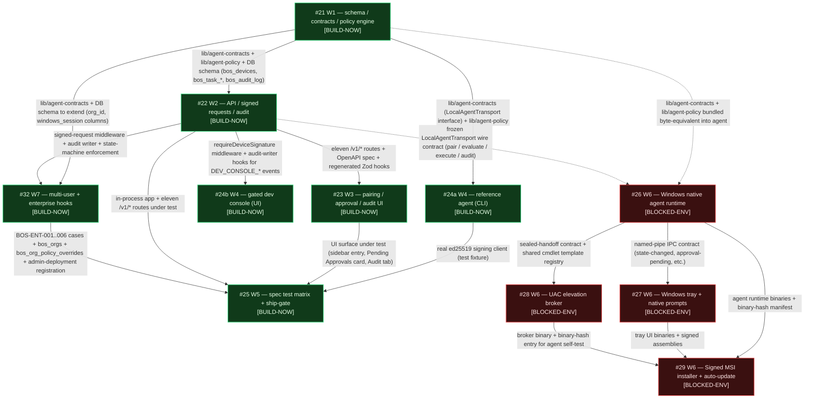

# Local Automation Agent — Master Plan & Crosswalk

**Status:** Authoritative roadmap as of 2026-04-26
**Owner of this document:** see Section G
**Source spec:** `attached_assets/Pasted-text-TRI-STATE-GO-MODE-EXECUTION-ONLY-TARGET-BOS-OMEGA-_1777210493011.txt`
**Architectural decisions of record:** `attached_assets/Pasted-ARCHITECTURAL-DECISIONS-These-are-now-resolved-Proceed-_1777212351123.txt`
**Auto-install consent rules:** `attached_assets/Pasted-AUTO-INSTALL-CONSENT-DOC-*.txt`

This is the single document that holds the entire Local Automation Agent (LAA) program together. It maps every individual project task to the spec items, the architectural decisions, and the ship-gate checklist it owns; it freezes the execution sequence; and it confirms that the cancelled PowerShell-bridge tasks (#4 and #15) leave no orphaned dependencies behind.

Documentation only — no production source files are edited by this work.

---

## A. Roadmap snapshot

The LAA program replaces the prior arbitrary-shell PowerShell bridge (project task #4) and its safety-tests subset (project task #15), both **CANCELLED**. The replacement is a 10-task program organised around 7 workstreams. Tasks marked **[BUILD-NOW]** can be implemented in this Linux Replit container; tasks marked **[BLOCKED-ENV]** require a real Windows build host and must not be assigned to a task agent in this project.

| Workstream | Project task | Plan file | Title | Build status | Current state | One-line summary |
|---|---|---|---|---|---|---|
| W1 — Schema, contracts & policy engine | **#21** | [`.local/tasks/laa-01-core-policy-engine.md`](../../.local/tasks/laa-01-core-policy-engine.md) | LAA — schema, contracts & policy engine | **[BUILD-NOW]** | PROPOSED | Adds the Drizzle schema, the shared contracts package, the canonical policy file, and the pure `evaluateTask` engine — the foundation every other task imports. |
| W2 — Server API + signed requests + audit | **#22** | [`.local/tasks/laa-02-api-signed-requests-audit.md`](../../.local/tasks/laa-02-api-signed-requests-audit.md) | LAA — API, signed requests & tamper-evident audit | **[BUILD-NOW]** | PROPOSED | Wires the eleven `/v1/*` routes, the ed25519-signed-request middleware, and the per-device hash-chain audit writer; removes the prior PowerShell-bridge routes with 410-Gone. |
| W3 — User-facing UI (pairing / approvals / audit) | **#23** | [`.local/tasks/laa-03-pairing-approval-ui.md`](../../.local/tasks/laa-03-pairing-approval-ui.md) | LAA — pairing, approval queue & audit UI | **[BUILD-NOW]** | PROPOSED | Adds the Local Agent page (Devices / Pending Approvals / Audit tabs) with the pairing wizard, full command-preview approval cards, and JSONL audit export. |
| W4 — Reference agent + gated dev console | **#24** | [`.local/tasks/laa-04-reference-agent-and-dev-console.md`](../../.local/tasks/laa-04-reference-agent-and-dev-console.md) | LAA — reference test agent + gated dev console | **[BUILD-NOW]** | PROPOSED | Stands up `tools/reference-agent` (a real ed25519-signing Node CLI) and the loopback-+-super-admin-gated `/dev/agent-console` so the system is exercisable end-to-end without a Windows host. |
| W5 — Spec test matrix + ship-gate | **#25** | [`.local/tasks/laa-05-spec-tests-and-ship-gate.md`](../../.local/tasks/laa-05-spec-tests-and-ship-gate.md) | LAA — spec test matrix & ship-gate checks | **[BUILD-NOW]** | PROPOSED | Encodes BOS-POLICY-001..010 + BOS-ENT-001..006 + the spec section-13 ship-gate as automated tests; the build pipeline goes red on any regression. |
| W6 — Windows native runtime | **#26** | [`.local/tasks/laa-06-windows-runtime-deferred.md`](../../.local/tasks/laa-06-windows-runtime-deferred.md) | Windows native local agent | **[BLOCKED-ENV]** | PROPOSED | The DPAPI-sealed, locally-policy-enforcing Windows agent runtime that pairs with the server and refuses any task the embedded engine rejects, even if the server says ALLOW. |
| W6 — Windows tray UI / native prompts | **#27** | [`.local/tasks/laa-07-windows-tray-prompts-deferred.md`](../../.local/tasks/laa-07-windows-tray-prompts-deferred.md) | System tray UI + native approval prompts | **[BLOCKED-ENV]** | PROPOSED | Tray icon + native approval dialogs that mirror the web UI's per-action approval semantics and are hardened against message-injection / sendkeys auto-clicking. |
| W6 — UAC elevation broker | **#28** | [`.local/tasks/laa-08-uac-broker-deferred.md`](../../.local/tasks/laa-08-uac-broker-deferred.md) | UAC elevation broker | **[BLOCKED-ENV]** | PROPOSED | A signed, single-shot, sealed-handoff broker that performs elevated execution out-of-process so the unelevated agent never holds an admin token. |
| W6 — Signed MSI installer + auto-update | **#29** | [`.local/tasks/laa-09-installer-deferred.md`](../../.local/tasks/laa-09-installer-deferred.md) | Signed MSI installer + auto-update + uninstall/recovery | **[BLOCKED-ENV]** | PROPOSED | Authenticode-signed MSI bundling runtime + tray + broker, with disclosure-screen consent, signed auto-update, and an uninstall path that destroys the device key and seals the audit chain. |
| W7 — Multi-user & enterprise hooks | **#32** | [`.local/tasks/multi-user-enterprise-hooks.md`](../../.local/tasks/multi-user-enterprise-hooks.md) | LAA — multi-user & enterprise hooks (architecture) | **[BUILD-NOW]** | PROPOSED | Adds `bos_orgs`, `org_id` columns, `windows_session` columns, `bos_org_policy_overrides`, and the `INDIVIDUAL_CONSENT` vs `ADMIN_DEPLOYMENT` install-mode flag so the system is multi-user / enterprise-capable from day one. |

**Cancelled:**
- **#4** — Windows PowerShell bridge (`.local/tasks/powershell-bridge.md`). Concept replaced by W1+W2+W6. See Section F.
- **#15** — Add safety tests for PowerShell command policies (no plan file; existed only as a project-task entry attached to #4). Concept subsumed by W5. See Section F.

**Out of band (loosely related, NOT part of this roadmap):**
- #5 (PowerShell agents sidebar — server-side `pwsh` execution in the container) is a separate product surface from LAA and is not gated by this roadmap. If/when it ships, it must comply with the same policy engine (#21) once that engine exists.
- #17 (auto-revoke pairing tokens for offline agents) — folded into #21's device lifecycle (`bos_devices.status` plus the audit-event types in #22). See Section F.

---

## B. Dependency graph

The graph below is the source of truth for ordering. Edges are hard prerequisites: the head cannot meaningfully start until the tail is merged. `[BUILD-NOW]` nodes can be assigned in this environment; `[BLOCKED-ENV]` nodes are documented but not runnable here.

**Reading the edges**
- Solid edge = build-time prerequisite: the contracts/types/migrations/routes from the tail must be merged before the head can compile or run.
- Dashed edge (`-.contracts frozen.->`) = the deferred Windows tasks are designed *against* the contracts of #21/#22 but cannot be implemented in this environment. Freezing those contracts is what makes the deferred tasks safe to start the moment a Windows host appears.

**Notes on apparent split nodes**
- #24 is shown as `T24a` (the Node.js reference agent CLI in `tools/reference-agent`) and `T24b` (the gated `/dev/agent-console` route + UI). They live in the same project task plan and ship together, but they have different upstream dependencies (24a only needs #21; 24b needs #22 to be live). The task agent must merge both halves to consider #24 done; this split is for sequencing only.

---

## C. Execution sequence — five phases

Phases are **mergeable units**. Anything inside a phase can be parallelised across task agents because no item inside a phase depends on another item inside the same phase. Phase boundaries are hard merge points.

### Phase 0 — Foundation
- **#21** — schema, contracts & policy engine
- *Why first:* every other build-now task imports `lib/agent-contracts` and/or `lib/agent-policy`. Nothing else can compile until these packages exist.
- *Exit criteria:* migration applied; BOS-POLICY-001..010 unit tests green inside the policy-engine package; contracts package version pinned.

### Phase 1 — Server runtime + reference agent CLI (parallel pair)
- **#22** — API / signed requests / audit writer
- **#24a** — reference agent CLI (`tools/reference-agent`, no UI yet)
- *Why parallel:* both consume #21's contracts. #24a does not need any HTTP route to compile — it implements the `LocalAgentTransport` interface and stubs its server-side methods until #22 lands. They merge in either order; whichever lands second wires the integration.
- *Exit criteria:* the eleven spec routes exist; signed-request middleware verifies real ed25519 sigs; audit hash chain writes & verifies; reference-agent CLI can pair against the running server using the real pair-code flow.

### Phase 2 — User surface + dev console + enterprise hooks (parallel triple)
- **#23** — pairing / approval / audit UI in `bos-omega`
- **#24b** — gated `/dev/agent-console` + UI
- **#32** — multi-user & enterprise hooks (schema deltas, contracts deltas, server policy semantics, install-mode flag, Enterprise tab in #23's page)
- *Why parallel:* all three consume #22's routes. They touch different surfaces:
  - #23 → the user-facing Local Agent page (Devices / Pending Approvals / Audit tabs).
  - #24b → a separate `/dev/...` route invisible in production.
  - #32 → schema additions (`bos_orgs`, `org_id` columns, `windows_session` columns, `bos_org_policy_overrides`, `bos_install_modes`), new `/v1/orgs/*` routes, and a thin Enterprise tab inside #23's page.
- *Coordination:* #32 adds the Enterprise tab structure inside #23's page. If #23 ships first, #32 extends; if #32 ships first, #23 must keep the Enterprise tab placeholder. Either order works because #32's tab is super-admin-only and ships behind `requireRole("super_admin")`.
- *Exit criteria:* a super admin can pair the reference agent end-to-end through the real UI; approve a structured task; observe the chain-verified audit row; create an org, lock a policy field, and pair a device under `ADMIN_DEPLOYMENT` mode using the reference agent's enrollment-secret entry point.

### Phase 3 — Spec executable + ship-gate
- **#25** — spec test matrix (BOS-POLICY-001..010 + BOS-ENT-001..006) + ship-gate runner
- *Why last among build-now:* this task asserts everything Phases 0–2 produced. It is the regression net, and it is what makes the spec executable. It must run after #32 because it owns the BOS-ENT-* cases too.
- *Exit criteria:* `pnpm --filter @workspace/agent-tests ship-gate` exits non-zero on any deliberate regression of the policy engine, signed-request middleware, audit chain, approval flow, or org-binding logic. Build pipeline gates on it.

### Phase 4 — Deferred Windows workstream (NOT executable in this environment)
- **#26** — Windows native agent runtime
- **#27** — Windows tray UI + native approval prompts (depends on #26)
- **#28** — UAC elevation broker (depends on #26)
- **#29** — Signed MSI installer + auto-update + uninstall/recovery (depends on #26, #27, #28)
- *Status:* `IMPLEMENTATION_BLOCKED_BY_ENVIRONMENT`. Plans live in source so the contracts are frozen and ready to consume. **Do not assign these tasks to a task agent in this Replit project.**
- *When unblocked:* requires (a) a Windows build host, (b) an Authenticode publisher certificate in an HSM, (c) operator with admin access to a Windows test machine. At that point #26 starts; #27/#28 can begin once #26's IPC contract is frozen; #29 ships last and bundles all three.

---

## D. Critical path

### D.1 — Canonical longest chain

The longest chain of hard prerequisites in the build-now portion of the program — and therefore the canonical critical path against which slip is measured — is:

> **#21 → #22 → #23 → #25 → ship-gate green**

with **#24a** and **#32** absorbed in parallel as co-gates of #25 (see D.3).

This is the chain to schedule against. No build-now path is longer; nothing ships before this chain completes.

### D.2 — Two single points of coupling (bottlenecks)

The whole program funnels through two artefacts published by **#21**:

1. **`lib/agent-contracts`** — the TypeScript contracts (enums, policy interfaces, `LocalAgentTransport`, `WindowsSessionInfo`, `EnterprisePolicyBinding`, `OrgScope`, `StructuredTaskRequest`, `ApprovalToken`, audit-event types). Every other build-now task (#22, #23, #24, #25, #32) and every deferred Windows task (#26, #27, #28, #29) imports from here.
2. **`lib/agent-policy`** — the pure `evaluateTask` engine + canonical policy file + JSON Schema. Imported by #22 (server-side enforcement), #25 (spec matrix asserts engine output), #26 (locally re-runs the same engine), and #28 (broker re-runs elevation rules).

If either package's surface changes after Phase 1, every dependent task pays the migration cost. Treat both packages as **frozen contracts** the moment #21 merges; further changes go through a deliberate contract-bump task.

### D.3 — Migration-window risk: #21 ↔ #32 schema overlap

**#32** adds columns and tables that extend **#21**'s tables: `org_id` columns on `bos_devices` / `bos_agent_policies` / `bos_task_requests` / `bos_approval_tokens` / `bos_task_executions` / `bos_audit_log`; `windows_session` JSONB columns on `bos_task_requests` / `bos_task_executions`; new tables `bos_orgs`, `bos_org_policy_overrides`, `bos_install_modes`. There is a **migration window** between #21 merging and #32 merging during which:

- The base tables exist but the org/session columns do not — anything in Phase 1 / Phase 2 written before #32 lands must default `org_id` to `NULL` and accept rows without `windows_session`.
- The policy engine's signature changes when it gains the optional `EnterprisePolicyBinding` argument. Callers compiled before #32 merges must keep working (the parameter is optional and defaults to "no enterprise binding").
- Migrations must be additive only — `ALTER TABLE … ADD COLUMN` with NULLABLE defaults — so #32 does not require a backfill of pre-existing personal-install rows.

**Mitigation:** schedule #32 to merge **before** #23 enters the Enterprise-tab work (Phase 2), and gate #25's BOS-ENT-001..006 cases on #32's migration being applied. If the schedule slips and #23 lands first, its Enterprise tab ships behind a "no orgs configured" empty-state, which is acceptable.

### D.4 — Per-task slip impact

| Slip in | Delays canonical chain (#21→#22→#23→#25)? | Delays ship-gate green? | Delays user-readiness? | Notes |
|---|---|---|---|---|
| **#21** | **yes — head of chain** | yes | yes | Highest-leverage delay. Every other build-now task imports its contracts and policy engine. |
| **#22** | yes | yes | yes | All UI / agent / test / enterprise work consumes its routes and middleware. |
| **#23** | **yes — on the canonical chain** | not strictly (spec tests hit the API in-process) | yes | The user surface is part of the canonical longest chain because "shipped" means a human can use it. |
| **#24a** | absorbed parallel of #25 | yes | yes (nothing to pair against) | Reference-agent CLI is the signing client both the user flow and the spec matrix depend on. |
| **#24b** | no | no | partial (loses dev console only) | Engineer-only surface. |
| **#25** | **yes — terminal of chain** | **yes — by definition** | gate, not feature | Without #25 green, no "ready" claim is valid. |
| **#32** | absorbed parallel co-gate of #25 | yes (BOS-ENT-001..006 + section 13 `enterprise.*`) | partial (no Enterprise tab + no admin-deployment pairing) | Owns the migration-window risk in D.3. |
| #26–#29 | no | no (skipped with `IMPLEMENTATION_BLOCKED_BY_ENVIRONMENT`) | no (deferred surface) | Off both critical paths in this environment. Plans ship contracts only. |

The deferred Windows phase sits entirely off the canonical chain and cannot be on the critical path of anything that ships from this Replit project.

---

## E. Validation matrix

Three orthogonal sources of truth feed the validation matrix. Every row binds one rule (architectural, policy-test, or ship-gate) to the project task that owns it and the artefact (code or test) that proves it.

### E.1 — Architectural decisions of record (7 decisions)

Source: `attached_assets/Pasted-ARCHITECTURAL-DECISIONS-These-are-now-resolved-Proceed-_1777212351123.txt`.

| # | Decision (resolved) | Owning task(s) | Artefact that proves it |
|---|---|---|---|
| 1 | **Installer model** — signed MSI; non-silent default; explicit consent screen; visible in Add/Remove Programs, Startup Apps, system tray, BOS-OMEGA Settings. | **#29** (BLOCKED-ENV) | MSI build pipeline + disclosure-screen integration test |
| 2 | **Pairing / device trust** — ed25519 device keypair; DPAPI-sealed private key; outbound HTTPS only; cert-pinned; pair-code one-shot exchange. | **#21** (contracts), **#22** (server), **#26** (Windows runtime — BLOCKED-ENV), **#24a** (reference agent — proves it works in Linux) | `requireDeviceSignature` middleware tests + reference-agent end-to-end pair test |
| 3 | **Approval UX** — per-action by default; full command preview byte-for-byte; typed-confirmation for destructive tiers; separate elevation toggle; no "Always allow" outside `always_allow_exact_template_only`. Hybrid / batched / scoped temporary approvals are permitted **only** as `always_allow_exact_template_only` template-scoped opt-ins (per-template, never global), and only for explicitly enumerated templates in the policy file. Edit-request flow creates a new task with a new hash; mutation-after-approval is forbidden. | **#21** (template-scoping data shape + engine semantics for `always_allow_exact_template_only`), **#22** (server enforcement of token reuse vs single-use), **#23** (user UI: per-action queue, per-template opt-in surface, edit-request flow), **#27** (native Windows dialog mirrors web UI semantics — BLOCKED-ENV) | Engine unit tests for template-scoped reuse vs single-use; UI integration tests for typed-confirmation, elevation toggle, and edit-request-creates-new-task; BOS-POLICY-003 (approval required), BOS-POLICY-004 (hash mismatch blocks reuse); ship-gate `approval.*` checks (`per_action_approval_enabled`, `approval_bound_to_command_hash`, `approval_expiration_enabled`, `blanket_approval_disabled`, `destructive_typed_confirmation_enabled`) |
| 4 | **Audit log immutability** — append-only; per-device hash chain; `policy_version` + `command_hash` + `previous_log_hash` on every row; daily verifier; secret-redacted stdout/stderr; output hash. | **#22** (writer + verifier) | Hash-chain unit tests + ship-gate `audit.*` checks |
| 5 | **Windows user model** — multi-user-capable from day one. Agent runs under the current interactive user by default; no retained admin token; elevation goes through a separate broker process. Every approval and execution is bound to a specific Windows user/session (`{sid, username, session_id, is_remote_session, is_admin_session}`); cross-session approval reuse is rejected (`SESSION_BINDING_MISMATCH`). The cryptographic device identity is the sole machine-trust root; `windows_session` is advisory binding metadata only and never widens what a device may do. | **#21** (`WindowsSessionInfo` contract + engine session-binding semantics), **#22** (server middleware accepts and persists `windows_session`; rejects cross-session approval reuse), **#32** (`windows_session` JSONB columns on `bos_task_requests` / `bos_task_executions`; org binding; precedence stack; offboarding/transfer model), **#26** (Windows runtime enumerates the active session under DPAPI per-user — BLOCKED-ENV), **#28** (broker re-validates session at elevation time — BLOCKED-ENV) | BOS-POLICY-006 (`RETAINED_ADMIN_TOKEN_FORBIDDEN`); BOS-ENT-002 (`SESSION_BINDING_MISMATCH`); ship-gate `elevation.current_user_default`, `elevation.no_retained_admin_token`, `elevation.elevation_broker_present`, `elevation.raw_shell_to_broker_blocked`, `elevation.separate_elevation_approval_required`; reference-agent test that two simulated sessions cannot share an approval token |
| 6 | **Update model** — signed manifest; signed payloads; transactional swap; fallback on failure; new policy version is treated as content change requiring re-evaluation, never silent permission grant. | **#29** (BLOCKED-ENV) | Update-channel integration test on Windows |
| 7 | **Deployment model** — supports `INDIVIDUAL_CONSENT` (default) and `ADMIN_DEPLOYMENT` (per-org enrollment secret). Org-locked policy fields cannot be widened by device-local edits. Windows session binding on every approval/execution. | **#32** (server data model + contracts + routes); **#29** (silent-install gating — BLOCKED-ENV); **#27** (tray honours org status — BLOCKED-ENV) | BOS-ENT-001..006 in #25; `bos_orgs` + `bos_org_policy_overrides` migration; admin-deployment registration test |

### E.2 — BOS-POLICY-001..010 cases (spec section 12)

Every case is owned at the unit-test level by **#21** (pure engine, no I/O) and at the integration-test level by **#25** (real route + real DB + real signature middleware). The owning task ships the case green; the gate task asserts the case stays green forever.

| Case | Name (per spec) | Expected | Unit-test owner | Integration-test owner |
|---|---|---|---|---|
| BOS-POLICY-001 | Allows low-risk read-only diagnostic | `ALLOW` | #21 | #25 |
| BOS-POLICY-002 | Blocks arbitrary shell | `BLOCK` / `ARBITRARY_SHELL_ENABLED_FORBIDDEN` | #21 | #25 |
| BOS-POLICY-003 | Requires approval for file write | `REQUIRE_APPROVAL` | #21 | #25 |
| BOS-POLICY-004 | Blocks changed command after approval | `BLOCK` / `APPROVAL_COMMAND_HASH_MISMATCH` | #21 | #25 |
| BOS-POLICY-005 | Requires UAC for elevation | `REQUIRE_STRONG_APPROVAL_PLUS_UAC`, `requires_uac: true` | #21 | #25 |
| BOS-POLICY-006 | Blocks retained admin token | `BLOCK` / `RETAINED_ADMIN_TOKEN_FORBIDDEN` | #21 | #25 |
| BOS-POLICY-007 | Blocks encoded PowerShell | `BLOCK` / `TASK_MATCHES_BLOCKLIST` | #21 (blocklist data file) | #25 |
| BOS-POLICY-008 | Blocks credential access | `BLOCK` / `TASK_TIER_BLOCKED_BY_DEFAULT` | #21 | #25 |
| BOS-POLICY-009 | Blocks unauthenticated local API | `BLOCK` / `LOCAL_API_AUTH_REQUIRED` | #21 | #25 |
| BOS-POLICY-010 | Blocks hidden install | `ABORT_SHIP` / `HIDDEN_INSTALL_FORBIDDEN` | #21 (engine surfaces ABORT) | #25 (ship-gate runner exits non-zero on `ABORT_SHIP`) |

**Plus** the multi-user / enterprise extension owned by #32 and gated by #25:

| Case | Name | Owning task | Gate task |
|---|---|---|---|
| BOS-ENT-001 | Cross-org approval rejection | #32 | #25 |
| BOS-ENT-002 | Session-binding mismatch rejection (`SESSION_BINDING_MISMATCH`) | #32 | #25 |
| BOS-ENT-003 | Locked-field-widening rejection (`ENTERPRISE_POLICY_FIELD_LOCKED`) | #32 | #25 |
| BOS-ENT-004 | Admin-deployment registration via enrollment secret | #32 | #25 |
| BOS-ENT-005 | Dual-mode pairing (interactive + enrollment-secret) on the same server | #32 | #25 |
| BOS-ENT-006 | Audit chain integrity across an org-locked field change | #32 | #25 |

### E.3 — Ship-gate checklist (spec section 13)

Ship-gate sub-section → owning project task. Items marked **BLOCKED-ENV** are listed in the `pnpm --filter @workspace/agent-tests ship-gate` report under their full name with skip reason `IMPLEMENTATION_BLOCKED_BY_ENVIRONMENT`, so they remain visible.

| Sub-section | Item | Owning task | Run state in this environment |
|---|---|---|---|
| `installer.disclosure_text_present` | Disclosure screen text | #29 | **BLOCKED-ENV** |
| `installer.explicit_consent_capture` | "I understand" gate | #29 | **BLOCKED-ENV** |
| `installer.uninstall_entry_present` | Add/Remove Programs entry | #29 | **BLOCKED-ENV** |
| `installer.tray_status_visible` | Tray icon present | #27 | **BLOCKED-ENV** |
| `installer.settings_page_visible` | BOS-OMEGA Settings > Devices entry | #23 | runs |
| `pairing.signin_required` | Pair-code requires authenticated user | #22 | runs |
| `pairing.device_registration_required` | `POST /v1/devices/register` enforced | #22 | runs |
| `pairing.device_public_key_generated` | Reference agent generates ed25519 key | #24a (sim), #26 (Win) | runs (via #24a) |
| `pairing.device_name_required` | UI gates pairing on typed name | #23 | runs |
| `pairing.pairing_confirmation_required` | Final "Confirm pairing" step in wizard | #23 | runs |
| `execution.arbitrary_shell_disabled` | Engine blocks `arbitrary_shell` | #21 | runs |
| `execution.persistent_shell_disabled` | Engine blocks `persistent_shell` | #21 | runs |
| `execution.structured_tasks_only` | Engine blocks anything not structured | #21 | runs |
| `execution.signed_task_required` | Middleware blocks unsigned requests | #22 | runs |
| `execution.task_expiration_required` | Engine blocks expired tasks | #21 | runs |
| `execution.local_policy_enforcement_required` | Same engine runs locally on agent | #26 (BLOCKED-ENV); #24a proves the contract works | runs (via #24a) |
| `execution.command_hash_required` | Server recomputes hash and binds approval to it | #22 | runs |
| `approval.per_action_approval_enabled` | One approval per action | #22 + #23 | runs |
| `approval.approval_bound_to_command_hash` | Token carries `command_hash` and is matched server-side | #22 | runs |
| `approval.approval_expiration_enabled` | Tokens expire per policy | #22 | runs |
| `approval.blanket_approval_disabled` | No "Always allow" path outside `always_allow_exact_template_only` | #21 (engine), #23 (UI surface) | runs |
| `approval.destructive_typed_confirmation_enabled` | Typed-verb confirmation for HIGH / HIGH_CRITICAL | #23 | runs |
| `elevation.current_user_default` | Default run context = `CURRENT_USER` | #21 (policy data), #26 (runtime — BLOCKED-ENV) | runs (engine half) |
| `elevation.elevation_broker_present` | Separate broker process | #28 | **BLOCKED-ENV** |
| `elevation.raw_shell_to_broker_blocked` | Broker rejects non-handoff input | #28 | **BLOCKED-ENV** |
| `elevation.separate_elevation_approval_required` | Elevation toggle separate from approval | #21 + #22 + #23 | runs |
| `elevation.windows_uac_required` | Engine rejects elevation without UAC policy | #21 | runs |
| `elevation.no_retained_admin_token` | Server rejects policies that retain an admin token (BOS-POLICY-006) | #21 + #22 | runs |
| `audit.audit_required` | Every transition writes an event | #22 | runs |
| `audit.append_only_logs` | DB schema enforces append-only | #21 (schema), #22 (writer) | runs |
| `audit.tamper_evident_hash_chain` | Per-device hash chain | #22 | runs |
| `audit.secret_redaction` | Redaction pass on stdout/stderr | #22 | runs |
| `audit.output_hash` | `output_hash` on every execution | #22 | runs |
| `audit.exportable_logs` | JSONL export + chain-verification flag | #22 (route) + #23 (button) | runs |
| `enterprise.remote_revoke` | `POST /v1/devices/{id}/revoke` works for org admin | #22 + #32 | runs |
| `enterprise.policy_lock` | `bos_org_policy_overrides` enforced by engine | #32 | runs |
| `enterprise.siem_export` | JSONL export endpoint + chain-verification | #22 (route); telemetry endpoint config in #32's `enterprise-config.md` | runs |
| `enterprise.disable_agent` | `POST /v1/devices/{id}/pause` works | #22 | runs |
| `enterprise.restrict_command_categories` | Org-locked allowlist categories | #32 | runs |

**Spec final-build rule (`FINAL_BUILD_RULE`):** the GO/HOLD/ABORT predicates from spec section 14 are derived facts; each one maps to one or more rows above. The ship-gate runner in #25 evaluates them as a single boolean and prints the resulting tri-state to the report header.

---

## F. Cancellation rebaseline — #4 and #15

This section discharges the contract from the task spec: **walk every "Done looks like" / "Steps" item from #4 and #15, and either map it to a current task or call it out as deliberately dropped, with reason. Confirm via search that no current `dependsOn` references #4 or #15.**

### F.1 — Search confirmation

A repo-wide search (`rg -n "dependsOn|depends_on" .local/tasks/`) returns no `dependsOn` field anywhere in the LAA plan files (#21–#29, #32). The only references to "PowerShell bridge" or "Task #4" in the current plan set are explicit **replacement / removal** statements:

- `laa-01-core-policy-engine.md:6` — *"non-negotiable replacement for the prior arbitrary-shell PowerShell bridge approach."*
- `laa-01-core-policy-engine.md:22` — out of scope: *"Migrating any data from prior PowerShell bridge tables."*
- `laa-02-api-signed-requests-audit.md:20, 34` — *"Existing routes from the prior PowerShell bridge are removed; their endpoints return 410 Gone."*
- `laa-03-pairing-approval-ui.md:28, 36` — *"The historical PowerShell-bridge UI is removed in this task; any leftover sidebar entries / pages from that prior feature are deleted."*
- `laa-06-windows-runtime-deferred.md:4` — *"This is the production replacement for the prior PowerShell bridge."*

There are zero references to #15 anywhere in the LAA plan set. The only references in the repo are in the master-plan sources themselves (this document and `task-33.md`), which exist to discharge the cancellation.

**Conclusion:** no orphaned dependency on #4 or #15 remains in #21–#29 or #32.

### F.2 — Concept-by-concept crosswalk from #4 (Windows PowerShell Bridge)

| Concept from `.local/tasks/powershell-bridge.md` | Disposition | Now owned by |
|---|---|---|
| Tables for paired agents (id, label, owner, token hash, last_seen, revoked_at) | **Replaced** by stronger schema | #21 — `bos_devices` (UUID PKs, ed25519 public key, status enum incl. `PAUSED` / `DISCONNECTED` / `REVOKED`, `last_seen`, `org_id` once #32 lands) |
| `command_requests` table (status enum, exit code, duration, truncation) | **Replaced** | #21 — `bos_task_requests` (state machine from spec section 11) + `bos_task_executions` (exit code, duration, output hash) |
| Streamed output chunks / single output blob | **Replaced** | #22 — execution row stores `output_hash` + `redacted_stdout` / `redacted_stderr`; raw output is never persisted |
| OpenAPI extension + Zod schema regeneration | **Replaced (different surface)** | #22 — eleven `/v1/*` routes; spec lives in `lib/api-spec/openapi.yaml`; Zod regen via existing pipeline |
| Pairing endpoint (short-lived one-time pair code) | **Replaced** | #22 — `POST /v1/devices/{id}/pair` short-lived code flow |
| Token exchange + long-lived agent token | **Replaced by stronger scheme** | #21 + #22 — ed25519 device keypair + signed-request middleware (no long-lived bearer token) |
| WebSocket connection from agent to server | **Deliberately dropped** | Per spec `network_model.websocket_raw_command_execution_allowed: false` and `outbound_only: true`. Agent uses outbound HTTPS poll/long-poll only. (#22, #26) |
| Server-side registry of live agent connections | **Replaced** | #22 — connection state derived from `bos_devices.status` + heartbeat audit events |
| Revocation drops the socket | **Replaced** | #22 — `POST /v1/devices/{id}/revoke` invalidates the device pubkey; #26 destroys local keypair on revoke |
| Manual command console / "type a command" UI | **Deliberately dropped** | Forbidden by spec (`manual_command_console_allowed: false`, structured tasks only). #23 surfaces approval queue, never a free-text command box. |
| Pending Approvals queue with approve/reject | **Replaced and tightened** | #23 — Pending Approvals tab with full command preview, typed-confirmation for destructive tiers, separate elevation toggle |
| Live-streaming stdout/stderr in UI | **Deliberately scoped down** | #22/#23 — execution result is a single hashed + redacted blob; no live stream. Removes a large class of secret-leak surface. |
| Per-command timeout / max output size / truncation | **Retained, moved into engine** | #21 — task-level limits in policy data; #22 — enforcement on execution row |
| Secret-shaped redaction before storage | **Retained and strengthened** | #22 — env-var values, JWT-shaped, base64url ≥ 32 chars near `key`/`token`/`secret`, applied before persistence |
| Configurable allow/deny list | **Replaced** | #21 — allowlist categories + blocklist as data in the canonical policy file (no string literals in code) |
| `runPowerShell` LLM tool that blocks on approval | **Out of scope of this roadmap** | If LAA later wants an agent-initiated path, it goes through `POST /v1/tasks/request` with `task_source = AI_AGENT` and the same approval/policy/audit flow. The synchronous "block on approval" coupling is not re-introduced; the LLM gets a structured pending/approved/denied response. |
| PowerShell-based installer script + `--unpair` | **Replaced** | #29 — signed MSI with explicit consent screen; uninstall destroys keypair + seals audit chain |
| Pair token stored on PC (user-scope secure location) | **Replaced** | #26 — DPAPI-sealed ed25519 private key, scoped to the current Windows user |
| Audit-log writes for every approval/rejection/output/timeout | **Retained and tightened** | #22 — every state transition writes a hash-chained event with `policy_version` + `command_hash` + `previous_log_hash` |
| End-to-end verification with a mock agent | **Replaced** | #24a — real reference agent in `tools/reference-agent`; #25 — automated spec matrix + ship-gate |

**Concepts deliberately dropped (with reason):**
1. **WebSocket raw command channel** — forbidden by `network_model` in the spec.
2. **Manual command console** — forbidden by `execution_policy.manual_command_console_allowed: false`.
3. **Live stdout/stderr stream to the browser** — increases the secret-leak surface area; replaced by hashed + redacted post-hoc storage.
4. **Bearer-token long-lived agent auth** — replaced by per-request ed25519 signatures so a stolen log line cannot grant a session.
5. **Synchronous LLM-blocking `runPowerShell`** — re-introducing this would couple LLM availability to user availability; instead the LLM submits a structured request and the user approves asynchronously through the same UI as everything else.

### F.3 — Concept-by-concept crosswalk from #15 (Add safety tests for PowerShell command policies)

#15 had no plan file; it existed as a project-task entry attached to #4. Its scope (per its title and the `local-agent-master-orchestration.md` reference) is the deny-list, output-redaction, and state-machine safety tests.

| Concept from #15 | Disposition | Now owned by |
|---|---|---|
| Deny-list test coverage | **Replaced** | #25 — BOS-POLICY-002 (arbitrary shell), BOS-POLICY-007 (encoded PowerShell), BOS-POLICY-008 (credential access), plus the policy-engine unit tests in #21 that cover every blocklist entry by data |
| Output redaction tests | **Replaced** | #25 — integration tests against the audit-writer redaction pass from #22 |
| State-machine safety (illegal transitions rejected) | **Replaced** | #25 — integration tests asserting 409 + audit event on every illegal transition of `bos_task_requests.status` (state machine defined in #21, enforced in #22) |

**Conclusion:** every safety-test concern from #15 is now owned by the spec test matrix and ship-gate runner in **#25**, with the engine-level subset additionally owned by **#21**'s unit tests.

### F.4 — Adjacent concept folded in (NOT cancelled, just relocated)

| Originally separate task | Disposition | Now owned by |
|---|---|---|
| **#17** — Auto-revoke pairing tokens for agents that go offline for too long | **Folded into #21 device lifecycle** | #21 schema includes `bos_devices.last_seen` + status enum (`CONNECTED` / `PAUSED` / `DISCONNECTED` / `REVOKED`). #22 emits the corresponding audit events when a heartbeat times out. The auto-revoke threshold lives as a data field in the canonical policy file. The standalone #17 entry remains in the project task list as a thin wrapper that may be closed once #21 + #22 ship; no re-implementation needed. |

---

## G. Owner & update protocol

### G.1 — Owner of this document

The owner of `docs/local-automation-agent/MASTER_PLAN.md` is **whoever holds the BOS-OMEGA super-admin role at the time of an update** (currently `paisabrazilfl@gmail.com`, owner row id `3af93547-1356-460b-aaea-1f1dcdce91df`). Updates are merged through the normal task-agent flow; no out-of-band edits.

### G.2 — When to update

This document MUST be updated whenever any of the following happens:

1. A new project task is added to the LAA program (`#21`–`#29`, `#32`, or any future `#N` whose plan file lives under `.local/tasks/laa-*` or `.local/tasks/multi-user-enterprise-hooks*`).
2. A project task in the LAA program is **cancelled** or **reassigned to a different workstream**.
3. The spec policy file (`attached_assets/Pasted-text-TRI-STATE-GO-MODE-EXECUTION-ONLY-TARGET-BOS-OMEGA-_1777210493011.txt`) changes — specifically the BOS-POLICY-* matrix, section 13 ship-gate checklist, or section 14 final build rule.
4. An architectural decision in `attached_assets/Pasted-ARCHITECTURAL-DECISIONS-These-are-now-resolved-Proceed-_1777212351123.txt` is revisited.
5. A dependency edge in Section B changes — e.g., #25 starts taking a hard dep on a new task, or a deferred Windows task adds a new prerequisite from a build-now task.

This document SHOULD be updated whenever:

- A phase exit-criterion is met or revised.
- A ship-gate item moves from `runs` to `BLOCKED-ENV` or vice-versa (e.g., once a Windows test host appears).
- A new BOS-ENT-* case is added.

### G.3 — Update protocol

1. Open a new project task whose deliverable includes editing this file. Documentation-only tasks are valid project tasks.
2. The task plan must enumerate which sections (A through G) are being touched and why.
3. The task agent edits both `MASTER_PLAN.md` and the affected `.local/tasks/laa-*.md` plan(s) in the same merge so the task plans and this master document never drift.
4. Run a code review subagent on the changes (architect mode, `includeGitDiff: true`) before requesting merge.
5. After merge, post a single-line summary of the change to the audit log via the existing super-admin audit feed (Task #37 surface, once it ships; until then, an entry in the existing `bos_audit_log` table is sufficient).

### G.4 — What this document is NOT

- It is **not** a substitute for the individual plan files. The plan files (`.local/tasks/laa-*.md`, `.local/tasks/multi-user-enterprise-hooks.md`) remain authoritative for the inside-the-task contract: scope, steps, "Done looks like", architectural notes, and relevant files.
- It is **not** a status board. Live status of each project task lives in the project-task system (`listProjectTasks`); this document captures the *plan*, not the *state*.
- It is **not** a substitute for the spec. Where this document and the spec disagree, the spec wins and this document gets fixed.

---

## Appendix — Revision history

| Date | Author | Summary |
|---|---|---|
| 2026-04-26 | Task #33 (LAA — master orchestration & crosswalk) | Initial publication. Locked in 7-workstream / 5-phase decomposition; bound architectural decisions, BOS-POLICY-001..010, BOS-ENT-001..006, and section 13 ship-gate items to owning tasks; rebaselined cancellation of #4 and #15 with concept-by-concept crosswalk; established owner & update protocol. |
